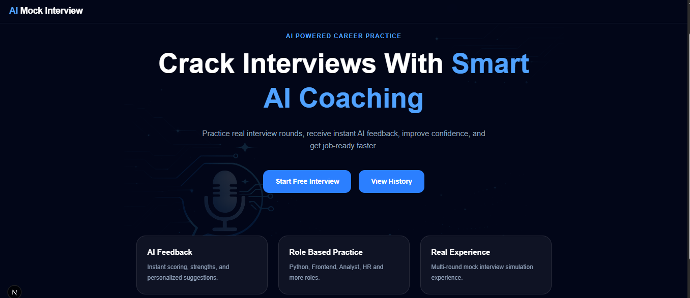
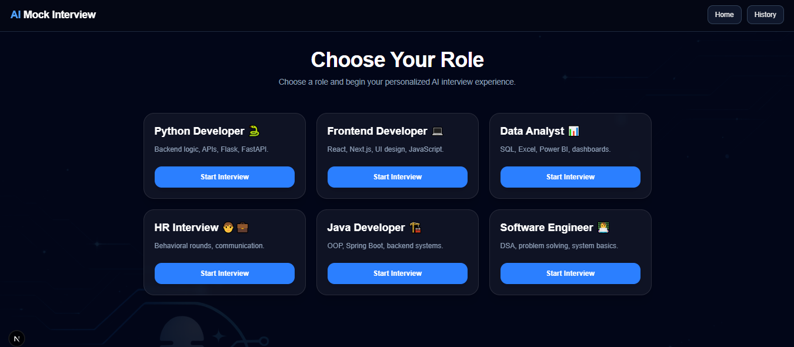
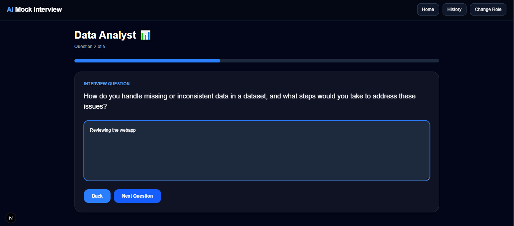
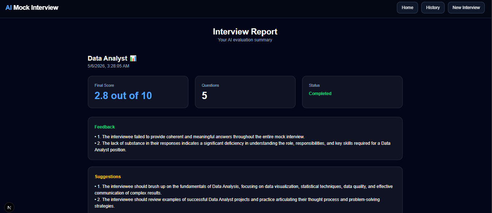
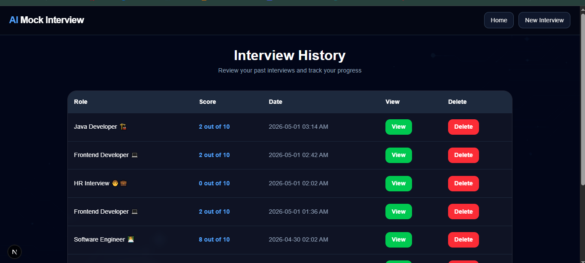

# 🚀 AI Mock Interview Platform

AI-powered mock interview platform that helps users practice real interview scenarios, receive instant AI feedback, and improve performance through structured evaluation.

---

## ✨ Features

- 🤖 AI-generated role-based interview questions  
- 💼 Multiple job roles supported:
  - Python Developer  
  - Frontend Developer  
  - Data Analyst  
  - HR Interview  
  - Java Developer  
  - Software Engineer  
- 🧠 5-question structured interview flow  
- ⬅️ Back navigation to review/edit answers  
- 📊 AI-powered evaluation report:
  - Score (X out of 10)  
  - Detailed feedback  
  - Improvement suggestions  
- 📁 Interview history tracking  
- 🗑️ Delete past interviews  
- 🎨 Premium responsive UI (dark theme)  
- ⚡ Fast and smooth experience  

---

## 🛠 Tech Stack

### Frontend
- Next.js (App Router)
- React
- TypeScript
- Tailwind CSS

### Backend
- FastAPI
- Python

### AI Integration
- Groq API (LLaMA 3)

### Database
- SQLite

---

## 📸 Screenshots

### 🏠 Home Page
<p align="center">
  
</p>

---

### 🎯 Select Role
<p align="center">
  
</p>

---

### 🎤 Interview Page
<p align="center">
  
</p>

---

### 📊 Dashboard Report
<p align="center">
  
</p>

---

### 📜 Interview History
<p align="center">
  
</p>

---

## 📂 Project Structure

```bash
ai-mock-interview/
│── app/
│   ├── page.tsx
│   ├── select-role/
│   ├── interview/
│   ├── dashboard/
│   └── history/
│
│── components/
│   └── Navbar.tsx
│
│── backend/
│   ├── main.py
│   ├── database.py
│   └── interviews.db
│
│── screenshots/
│   ├── home.png
│   ├── select-role.png
│   ├── interview.png
│   ├── dashboard.png
│   └── history.png

## ⚙️ How to Run Project

Frontend
npm install npm run dev
Runs on:
http://localhost:3000

Backend
cd backendpip install -r requirements.txtuvicorn main:app --reload
Runs on:
http://127.0.0.1:8000

🔑 Environment Variables
Create .env inside backend folder:
GROQ_API_KEY=your_api_key_here

🚀 Future Improvements

🔐 User authentication
📄 PDF report export
🎙 Voice-based interview mode
📷 Webcam interview simulation
🧠 Resume-based question generation
🌐 Multi-language support


💡 Project Purpose

This project simulates a real-world AI interview preparation platform, helping users:

- Practice structured interviews
- Improve communication skills
- Receive instant AI-driven feedback
- Track performance over time


## Why This Project

This project simulates a real AI interview preparation platform where users can practice role-based interviews, improve communication skills, and receive instant feedback.

---

## Author

Vinay Pandey

GitHub: https://github.com/VinayPandey185

```